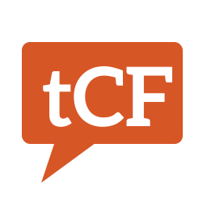

    

<h1 align="center">theCourseForum2</h1>

    
    
    
    

Connecting University of Virginia students to course information and reviews

> 2020 Django rewrite of [theCourseForum 1.0](https://github.com/thecourseforum/theCourseForum) website at [theCourseForum.com](https://thecourseforum.com/).

## About

_theCourseForum_ was created by students for students. We gather freely available information to help students evaluate their course options. Students in turn then review courses in their own words for others to help others.

Started 15 years ago, the project has grown monumentally. Over 10k users in the UVA student body uses the website each and every semester. We gather data and other information in an effort to help students better select classes. The source code in this repository is the third major version of the website.

_theCourseForum_ team is a group of students that contribute their time and effort to continue to improve the site for other students to use.

## [Developer Information](docs/dev.md)

## Want to get involved?

Don't hesitate to contact us whether or not that you are at the University of Virginia! We love to talk about our app and we love to discuss everything that we do! Join our [Discord server](https://discord.com/invite/tAjzH7eyvW) or shoot us an email at [info@thecourseforum.com](mailto:info@thecourseforum.com).
